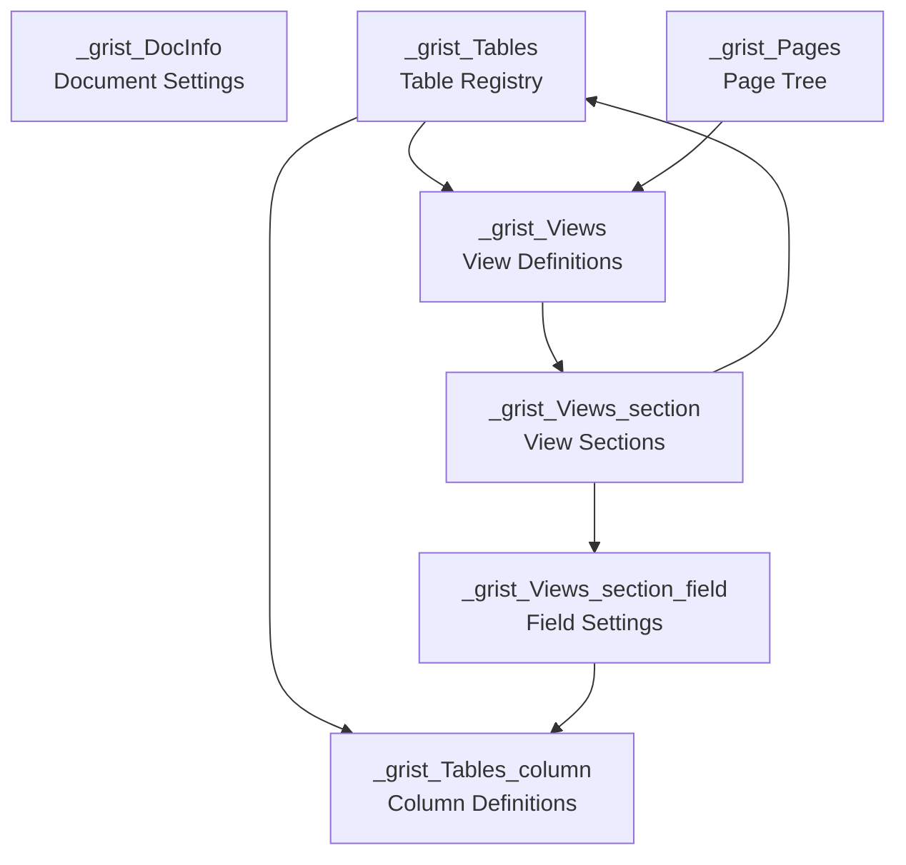
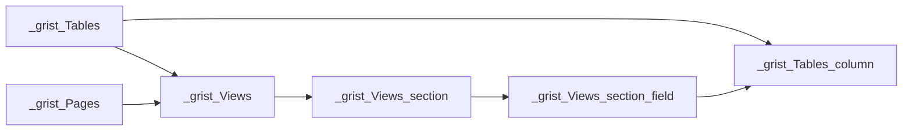

# Grist Schema Reference

**Complete reference for Grist metadata tables** - the system tables that define document structure.

**Schema Version**: 44 | **Last Updated**: 2025-11-15

---

## Quick Reference

| Table | Purpose | Key Fields |
|-------|---------|------------|
| **_grist_DocInfo** | Document settings | schemaVersion, timezone, documentSettings |
| **_grist_Tables** | User tables registry | tableId, primaryViewId, onDemand |
| **_grist_Tables_column** | Column definitions | colId, type, formula, visibleCol |
| **_grist_Views** | View definitions | name, layoutSpec |
| **_grist_Views_section** | View sections (widgets) | tableRef, parentKey, sortColRefs |
| **_grist_Views_section_field** | Field display settings | colRef, width, widgetOptions |
| **_grist_Pages** | Page hierarchy | viewRef, indentation, pagePos |
| **_grist_Filters** | Column filters | viewSectionRef, colRef, filter |
| **_grist_ACLResources** | ACL resource definitions | tableId, colIds |
| **_grist_ACLRules** | Access control rules | resource, aclFormula, permissionsText |
| **_grist_Attachments** | File attachments | fileIdent, fileName, fileSize |
| **_grist_Triggers** | Webhook triggers | tableRef, eventTypes, actions |
| **_grist_Shares** | Public shares | linkId, options |
| **_grist_Cells** | Cell metadata (comments) | tableRef, colRef, rowId, type |

---

## Table of Contents

- [Quick Reference](#quick-reference)
- [Schema Overview](#schema-overview)
- [Core Tables](#core-tables)
- [View Tables](#view-tables)
- [Access Control Tables](#access-control-tables)
- [Feature Tables](#feature-tables)
- [Data Types](#data-types)
- [Relationships](#relationships)
- [Deprecated Tables](#deprecated-tables)

---

## Schema Overview

### Architecture



### System vs Metadata

- **Metadata Tables** (`_grist_*`): Managed by Python data engine, defined in `sandbox/grist/schema.py`
- **System Tables** (`_gristsys_*`): Managed by Node.js, defined in `app/server/lib/DocStorage.ts`

---

## Core Tables

### _grist_DocInfo

Document-wide metadata. **Always exactly one record** with `id=1`.

| Column | Type | Description | Default | Required |
|--------|------|-------------|---------|----------|
| docId | Text | **DEPRECATED** (v44) - Now in _gristsys_FileInfo | `""` | |
| peers | Text | **DEPRECATED** - Now use _grist_ACLPrincipals | `""` | |
| basketId | Text | Basket ID for online storage | `""` | |
| schemaVersion | Int | Document schema version | `0` | ✓ |
| timezone | Text | Document timezone (e.g., 'America/New_York') | `""` | |
| documentSettings | Text | JSON settings (locale, currency, etc.) | `""` | |

**Example**:
```json
{
  "id": 1,
  "schemaVersion": 44,
  "timezone": "America/New_York",
  "documentSettings": "{\"locale\":\"en-US\"}"
}
```

**Source**: `sandbox/grist/schema.py:29`

---

### _grist_Tables

Registry of all user tables (excludes metadata tables).

| Column | Type | Description | Default |
|--------|------|-------------|---------|
| tableId | Text | Unique table identifier | `""` |
| primaryViewId | Ref:_grist_Views | Default view | `0` |
| summarySourceTable | Ref:_grist_Tables | Source table for summary tables | `0` |
| onDemand | Bool | Keep data out of engine (lazy load) | `False` |
| rawViewSectionRef | Ref:_grist_Views_section | Raw data view section | `0` |
| recordCardViewSectionRef | Ref:_grist_Views_section | Record card section | `0` |

**Summary Tables**:
- Have `summarySourceTable` pointing to source
- Automatically aggregate data by group-by columns
- Group-by columns have `summarySourceCol` set

**OnDemand Tables**:
- When `onDemand=true`, data not loaded into engine
- Fetched from database only when needed by frontend
- Useful for large, infrequently-accessed tables

**Example**:
```json
{
  "id": 1,
  "tableId": "People",
  "primaryViewId": 5,
  "summarySourceTable": 0,
  "onDemand": false
}
```

**Source**: `sandbox/grist/schema.py:47`

---

### _grist_Tables_column

Complete column definitions including formulas, types, and display settings.

| Column | Type | Description | Default |
|--------|------|-------------|---------|
| parentId | Ref:_grist_Tables | Parent table | `0` |
| parentPos | PositionNumber | Column order | `inf` |
| colId | Text | Column identifier | `""` |
| type | Text | Column type (Text, Numeric, Ref:Table, etc.) | `""` |
| widgetOptions | Text | JSON widget configuration | `""` |
| isFormula | Bool | True for formula columns | `False` |
| formula | Text | Python formula code | `""` |
| label | Text | Display label | `""` |
| description | Text | Column description | `""` |
| untieColIdFromLabel | Bool | Prevent auto-update of colId from label | `False` |
| summarySourceCol | Ref:_grist_Tables_column | Source column for summary | `0` |
| displayCol | Ref:_grist_Tables_column | Display helper column | `0` |
| visibleCol | Ref:_grist_Tables_column | Column to show in Ref | `0` |
| rules | RefList:_grist_Tables_column | Conditional formatting rules | `None` |
| reverseCol | Ref:_grist_Tables_column | Reverse reference column | `0` |
| recalcWhen | Int | When to recalculate (0=DEFAULT, 1=NEVER, 2=MANUAL_UPDATES) | `0` |
| recalcDeps | RefList:_grist_Tables_column | Trigger fields for recalc | `None` |

**RecalcWhen Values**:
- `0` (DEFAULT): Calculate on new records or when recalcDeps changes
- `1` (NEVER): Manual trigger only
- `2` (MANUAL_UPDATES): On new records and manual updates

**Reference Column Flow**:
```
Orders.customer (Ref:People)
  ├─ visibleCol → People.name (colId: 25)
  └─ displayCol → Orders._gristHelper_Display_customer (colId: 28)
                    └─ formula: "$customer.name"
```

**Example**:
```json
{
  "id": 5,
  "parentId": 1,
  "parentPos": 2.5,
  "colId": "total",
  "type": "Numeric",
  "isFormula": true,
  "formula": "$quantity * $price",
  "label": "Total"
}
```

**Source**: `sandbox/grist/schema.py:63`

---

## View Tables

### _grist_Pages

Page hierarchy (tree structure).

| Column | Type | Description | Default |
|--------|------|-------------|---------|
| viewRef | Ref:_grist_Views | Associated view | `0` |
| indentation | Int | Nesting level (depth) | `0` |
| pagePos | PositionNumber | Position when expanded | `inf` |
| shareRef | Ref:_grist_Shares | Share configuration | `0` |
| options | Text | JSON page options | `""` |

**Hierarchy Rules**:
- Indentation difference of **+1**: Child of previous page
- Indentation difference of **0**: Sibling
- Indentation difference of **-1**: Sibling of parent

**Example**:
```
pagePos | indent | Relationship
--------|--------|-------------
1.0     | 0      | Root
2.0     | 1      | Child of page 1
3.0     | 1      | Sibling of page 2
4.0     | 2      | Child of page 3
5.0     | 0      | Root (sibling of page 1)
```

Results in:
```
Page 1
├─ Page 2
└─ Page 3
   └─ Page 4
Page 5
```

**Source**: `sandbox/grist/schema.py:164`

---

### _grist_Views

View definitions.

| Column | Type | Description |
|--------|------|-------------|
| name | Text | View name |
| type | Text | View type (may be deprecated) |
| layoutSpec | Text | JSON layout specification |

**LayoutSpec Example**:
```json
{
  "type": "vertical",
  "children": [
    {"type": "section", "id": 1},
    {"type": "section", "id": 2}
  ]
}
```

**Source**: `sandbox/grist/schema.py:173`

---

### _grist_Views_section

View sections (widgets on pages).

| Column | Type | Description | Default |
|--------|------|-------------|---------|
| tableRef | Ref:_grist_Tables | Table displayed | `0` |
| parentId | Ref:_grist_Views | Parent view | `0` |
| parentKey | Text | Section type | `""` |
| title | Text | Section title | `""` |
| description | Text | Section description | `""` |
| defaultWidth | Int | Default column width | `100` |
| borderWidth | Int | Border width | `1` |
| theme | Text | Theme identifier | `""` |
| options | Text | JSON options | `""` |
| chartType | Text | Chart type (for charts) | `""` |
| layoutSpec | Text | Record layout JSON | `""` |
| filterSpec | Text | **DEPRECATED** (v15) | `""` |
| sortColRefs | Text | Sort column refs (JSON array) | `""` |
| linkSrcSectionRef | Ref:_grist_Views_section | Linked source section | `0` |
| linkSrcColRef | Ref:_grist_Tables_column | Linked source column | `0` |
| linkTargetColRef | Ref:_grist_Tables_column | Linked target column | `0` |
| embedId | Text | **DEPRECATED** (v12) | `""` |
| rules | RefList:_grist_Tables_column | Conditional formatting | `None` |
| shareOptions | Text | Share-specific options | `""` |

**Section Types (parentKey)**:
- `list`: Table/card list view
- `detail`: Single record detail view
- `single`: Single record (no scrolling)
- `chart`: Chart visualization
- `form`: Form view

**Section Linking**:
Linking allows selecting a record in one section to filter another:
- `linkSrcSectionRef`: Source section
- `linkSrcColRef`: Column in source
- `linkTargetColRef`: Column in this section's table to match

**Sort Format**:
```json
[1, -3, 5]  // Col 1 (asc), Col 3 (desc), Col 5 (asc)
```

**Source**: `sandbox/grist/schema.py:182`

---

### _grist_Views_section_field

Field display settings within sections.

| Column | Type | Description | Default |
|--------|------|-------------|---------|
| parentId | Ref:_grist_Views_section | Parent section | `0` |
| parentPos | PositionNumber | Field order | `inf` |
| colRef | Ref:_grist_Tables_column | Column displayed | `0` |
| width | Int | Field width (pixels) | `0` |
| widgetOptions | Text | JSON widget options | `""` |
| displayCol | Ref:_grist_Tables_column | Display column override | `0` |
| visibleCol | Ref:_grist_Tables_column | Visible column override | `0` |
| filter | Text | **DEPRECATED** (v25) | `""` |
| rules | RefList:_grist_Tables_column | Conditional formatting | `None` |

**Source**: `sandbox/grist/schema.py:209`

---

### _grist_Filters

Filter configurations for view sections.

| Column | Type | Description | Default |
|--------|------|-------------|---------|
| viewSectionRef | Ref:_grist_Views_section | Target section | `0` |
| colRef | Ref:_grist_Tables_column | Column filtered | `0` |
| filter | Text | JSON filter spec | `""` |
| pinned | Bool | Show in filter bar | `False` |

**Filter Format**:
```json
{"included": ["value1", "value2"]}
// or
{"excluded": ["value3", "value4"]}
```

**Source**: `sandbox/grist/schema.py:333`

---

## Access Control Tables

### _grist_ACLResources

Resource definitions for ACL rules.

| Column | Type | Description |
|--------|------|-------------|
| tableId | Text | Table name or '*' for all |
| colIds | Text | Column IDs (comma-separated) or '*' |

**Examples**:
```
tableId='*', colIds='*'              → All tables/columns
tableId='People', colIds='*'         → All columns in People
tableId='People', colIds='Email,Phone' → Specific columns
```

**Special Case**: Resource with `tableId=''` and `colIds=''` should be ignored (compatibility).

**Source**: `sandbox/grist/schema.py:271`

---

### _grist_ACLRules

Access control rules.

| Column | Type | Description | Default |
|--------|------|-------------|---------|
| resource | Ref:_grist_ACLResources | Target resource | `0` |
| permissions | Int | **DEPRECATED** | `0` |
| principals | Text | **DEPRECATED** | `""` |
| aclFormula | Text | Match formula (restricted Python) | `""` |
| aclColumn | Ref:_grist_Tables_column | **DEPRECATED** | `0` |
| aclFormulaParsed | Text | JSON parse tree | `""` |
| permissionsText | Text | Permission specification | `""` |
| rulePos | PositionNumber | Rule order | `inf` |
| userAttributes | Text | JSON user attribute definition | `""` |
| memo | Text | Rule description | `""` |

**Permission Format**:
- Format: `[+bits][-bits]`
- Bits: C (Create), R (Read), U (Update), D (Delete), S (Schema)
- Special: `'all'`, `'none'`
- Examples: `'+R'`, `'+CRUD'`, `'+R-U'`, `'all'`

**User Attributes**:
```json
{
  "name": "Students",
  "tableId": "StudentRoster",
  "lookupColId": "Email",
  "charId": "Email"
}
```
Looks up `user.Email` in `StudentRoster.Email`, makes record available as `user.Students`.

**Source**: `sandbox/grist/schema.py:271`

---

## Feature Tables

### _grist_Attachments

File attachment metadata.

| Column | Type | Description | Default |
|--------|------|-------------|---------|
| fileIdent | Text | Checksum (identifies file in _gristsys_Files) | `""` |
| fileName | Text | User-defined filename | `""` |
| fileType | Text | MIME type | `""` |
| fileSize | Int | Size in bytes | `0` |
| fileExt | Text | Extension with "." prefix | `""` |
| imageHeight | Int | Height in pixels (images only) | `0` |
| imageWidth | Int | Width in pixels (images only) | `0` |
| timeDeleted | DateTime | When deleted (soft delete) | `None` |
| timeUploaded | DateTime | When uploaded | `None` |

**Notes**:
- `fileIdent` is a checksum for deduplication
- Actual file data in `_gristsys_Files`
- `fileExt` added in v37 (April 2023)

**Source**: `sandbox/grist/schema.py:240`

---

### _grist_Triggers

Webhook triggers for table changes.

| Column | Type | Description | Default |
|--------|------|-------------|---------|
| tableRef | Ref:_grist_Tables | Table monitored | `0` |
| eventTypes | ChoiceList | Events ('add', 'update') | `None` |
| isReadyColRef | Ref:_grist_Tables_column | Ready flag column | `0` |
| actions | Text | JSON action array | `""` |
| label | Text | User-friendly label | `""` |
| memo | Text | Description | `""` |
| enabled | Bool | Is trigger active | `False` |
| watchedColRefList | RefList:_grist_Tables_column | Specific columns to watch | `None` |
| options | Text | JSON options | `""` |

**Event Types**:
- `'add'`: New records
- `'update'`: Record changes

**Actions Format**:
```json
[
  {
    "type": "webhook",
    "url": "https://example.com/hook"
  }
]
```

**Source**: `sandbox/grist/schema.py:259`

---

### _grist_Shares

Public share configurations.

| Column | Type | Description |
|--------|------|-------------|
| linkId | Text | Share identifier |
| options | Text | JSON share options |
| label | Text | User-friendly label |
| description | Text | Share description |

**Source**: `sandbox/grist/schema.py` (added v41)

---

### _grist_Cells

Cell-level metadata (currently: comments).

| Column | Type | Description | Default |
|--------|------|-------------|---------|
| tableRef | Ref:_grist_Tables | Table containing cell | `0` |
| colRef | Ref:_grist_Tables_column | Column containing cell | `0` |
| rowId | Int | Row ID | `0` |
| root | Bool | Is root node | `False` |
| parentId | Ref:_grist_Cells | Parent metadata node | `0` |
| type | Int | Metadata type (1=Comments) | `0` |
| content | Text | JSON metadata | `""` |
| userRef | Text | User who created | `""` |

**Hierarchy**:
- Tree structure (root + children)
- Root nodes: `root=True`
- Autoremove: When all children deleted, parent deleted

**Source**: `sandbox/grist/schema.py:347`

---

## Data Types

### Simple Types

| Type | Storage | Default | Description |
|------|---------|---------|-------------|
| Text | string | `''` | Text data |
| Int | integer | `0` | Integer (-2^53 to 2^53) |
| Numeric | float | `0.0` | Floating point |
| Bool | boolean | `False` | Boolean |
| Date | float | `None` | Date (timestamp) |
| DateTime | float | `None` | Date+time (timestamp) |
| Choice | string | `''` | Single choice |
| Blob | bytes | `None` | Binary data |
| Any | any | `None` | Any value type |
| Id | integer | `0` | Row ID (auto) |

### Reference Types

| Type | Format | Default | Description |
|------|--------|---------|-------------|
| Ref:Table | integer | `0` | Reference to row (**0 = null**) |
| RefList:Table | array | `None` | List of references |

### Position Types

| Type | Storage | Default | Description |
|------|---------|---------|-------------|
| PositionNumber | float | `inf` | Fractional position |
| ManualSortPos | float | `inf` | Manual sort position |

### List Types

| Type | Storage | Default | Description |
|------|---------|---------|-------------|
| ChoiceList | tuple | `None` | List of strings |
| Attachments | array | `None` | List of attachment IDs |

### Wire Format

Complex types use encoding for transmission:

| Type | Encoding | Example |
|------|----------|---------|
| Date | `['d', timestamp]` | `['d', 1704844800]` |
| DateTime | `['D', timestamp, tz]` | `['D', 1704945919, 'UTC']` |
| ChoiceList | `['L', ...]` | `['L', 'a', 'b']` |
| RefList | `['L', ...]` | `['L', 1, 2, 3]` |
| Reference | `['R', table, id]` | `['R', 'People', 17]` |
| Exception | `['E', name, msg]` | `['E', 'ValueError', 'Invalid']` |

**CRITICAL**:
- **RefList empty**: `null` OR `['L']` (both valid)
- **Ref null**: `0` (NOT `null`)

---

## Relationships

### Core Structure



### Key Relationships

1. **Tables → Columns**: One-to-many
2. **Tables → Views**: One-to-many (primaryViewId)
3. **Views → Sections**: One-to-many
4. **Sections → Fields**: One-to-many
5. **Section Linking**: Sections can link to other sections
6. **Column References**:
   - `displayCol`: Helper column for display
   - `visibleCol`: Column to show in UI
   - `reverseCol`: Two-way reference
   - `rules`: Conditional formatting formulas

---

## Deprecated Tables

These exist for backwards compatibility but should not be used:

| Table | Previous Purpose | Status |
|-------|-----------------|--------|
| **_grist_Imports** | Import options | Deprecated |
| **_grist_External_database** | External DB credentials | Deprecated |
| **_grist_External_table** | External table refs | Deprecated |
| **_grist_TableViews** | Table-View cross-ref | Deprecated |
| **_grist_TabItems** | Tab items | Deprecated |
| **_grist_TabBar** | Tab bar items | Partially deprecated |
| **_grist_ACLPrincipals** | ACL principals | Deprecated |
| **_grist_ACLMemberships** | ACL memberships | Deprecated |
| **_grist_Validations** | Validation rules | Deprecated |
| **_grist_REPL_Hist** | REPL history | Deprecated |

---

## Schema Versioning

**Current Version**: 44

### Migration Rules

**DO NOT**:
- Remove metadata tables or columns
- Rename metadata tables or columns
- Change types of existing columns

**INSTEAD**:
- Mark old columns as DEPRECATED with version comment
- Create new columns with new names
- Write migration to transform data
- Remove code references to deprecated entities

**Deprecation Comment Example**:
```python
# columnName is deprecated as of version XX. Do not remove or reuse.
```

### Compatibility

Schema must support:
- Documents from older Grist versions
- Collaboration between different Grist versions
- Opening upgraded documents with older versions

This is why deprecated columns remain in schema.

---

## Query Examples

### Find all columns in a table

```sql
SELECT colId, type, isFormula, label
FROM _grist_Tables_column
WHERE parentId = (SELECT id FROM _grist_Tables WHERE tableId = 'People')
ORDER BY parentPos;
```

### List pages and views

```sql
SELECT
  p.pagePos,
  p.indentation,
  v.name AS viewName
FROM _grist_Pages p
JOIN _grist_Views v ON p.viewRef = v.id
ORDER BY p.pagePos;
```

### Find all reference columns

```sql
SELECT
  t.tableId,
  c.colId,
  c.type
FROM _grist_Tables_column c
JOIN _grist_Tables t ON c.parentId = t.id
WHERE c.type LIKE 'Ref:%' OR c.type LIKE 'RefList:%'
ORDER BY t.tableId;
```

### Get ACL rules for a table

```sql
SELECT
  r.rulePos,
  r.aclFormula,
  r.permissionsText,
  r.memo,
  res.tableId
FROM _grist_ACLRules r
JOIN _grist_ACLResources res ON r.resource = res.id
WHERE res.tableId = 'People' OR res.tableId = '*'
ORDER BY r.rulePos;
```

---

## Additional Resources

- **Schema Definition**: `sandbox/grist/schema.py` (authoritative source)
- **TypeScript Schema**: `app/common/schema.ts` (auto-generated)
- **User Types**: `sandbox/grist/usertypes.py`
- **Wire Format**: `app/plugin/GristData.ts`
- **System Tables**: `app/server/lib/DocStorage.ts`

---

**Schema Version**: 44
**Last Updated**: 2025-11-15
**Maintainer**: Grist Labs (https://github.com/gristlabs/grist-core)
